# Pipeline flowchart

The full pipeline, from raw images to the outputs: Python preprocessing first, then
`sfm_main`, which runs `Pipeline::Run()` (`src/pipeline.cpp`). The incremental loop in
stage 4 is `IncrementalMapper` (`src/incremental_mapper.cpp`).

```mermaid
flowchart TD
    %% ---------- Stage 0: preprocessing (Python) ----------
    subgraph S0["0 · Preprocessing — tools/preprocess (Python)"]
        direction TB
        P0["Download dataset<br/>list images, apply prepare.yaml exclude"]
        P1["Read EXIF / GPS / DJI XMP<br/>→ preprocess/metadata.json"]
        P2["Group images into cameras<br/>fx = focal_mm × width / sensor_width (sensor_db.json)"]
        P3["GPS → local ENU<br/>→ trajectory.txt, geo_origin.yaml"]
        P4["Write config.yaml<br/>cameras, trajectory, matching mode, ortho"]
        P0 --> P1 --> P2 --> P3 --> P4
    end

    P4 -->|"./sfm_main config.yaml"| L0

    %% ---------- Stage 1: load ----------
    subgraph S1["1 · Load images — LoadImages"]
        direction TB
        L0["Image list → Image{id, path, camera_id}"]
        L1["Load trajectory priors<br/>name X Y Z  or  ω φ κ X Y Z"]
        L2["Fill missing camera width/height<br/>from the first image of each camera"]
        L0 --> L1 --> L2
    end

    L2 --> F0

    %% ---------- Stage 2: SIFT ----------
    subgraph S2["2 · SIFT (OpenMP, per image) — ExtractFeatures"]
        direction TB
        F0{"cache/features/*.sift<br/>valid for these params?"}
        F1["Load features"]
        F2["SIFT / RootSIFT<br/>save to cache"]
        F3["Undistort keypoints<br/>→ normalized coordinates"]
        F0 -->|yes| F1 --> F3
        F0 -->|no| F2 --> F3
    end

    F3 --> M0

    %% ---------- Stage 3: matching + ROP ----------
    subgraph S3["3 · Matching + ROP — MatchAndEstimateRops"]
        direction TB
        M0{"cache/rops.bin<br/>valid?"}
        M1["SelectPairs<br/>exhaustive · sequential · trajectory knn/radius"]
        M2["FLANN matching<br/>ratio test, optional cross-check"]
        M3{"≥ min_matches?"}
        M4["5-point E in RANSAC<br/>decompose + cheirality<br/>Sampson refinement<br/>H/E ratio, median triangulation angle"]
        M5{"≥ min_inliers?"}
        M6["Add edge to ViewGraph<br/>save cache"]
        MX["Drop pair"]
        M7["Load ViewGraph"]
        M8["Release descriptors"]
        M0 -->|no| M1 --> M2 --> M3
        M3 -->|yes| M4 --> M5
        M3 -->|no| MX
        M5 -->|yes| M6 --> M8
        M5 -->|no| MX
        M0 -->|yes| M7 --> M8
    end

    M8 --> I0

    %% ---------- Stage 4: incremental SfM ----------
    subgraph S4["4 · Incremental SfM — IncrementalMapper::Run"]
        direction TB
        I0["Seed: image with the most pairs × its strongest neighbours<br/>triangulation angle ≥ 3°, H/E ratio ≤ 0.8<br/>A = origin, B at the ROP, baseline = 1"]
        I1{"Enough seed points?"}
        IF["No seed pair — exit code 2"]
        I2["Give failed images that overlap<br/>the last added image another chance"]
        I3{"Candidates left?<br/>unregistered, with registered neighbours"}
        I4["Pass 1 · ≥ 2 registered neighbours<br/>rotation averaging RANSAC (Horn quaternion)<br/>position with R fixed (LTS) + pose refinement"]
        I5{"RMS < 5 px?"}
        I6["Pass 2 · single-neighbour fallback<br/>R from one ROP, same position solver"]
        I7{"Best score < 20 px?"}
        I8["Add image<br/>pose + 2D–3D observations<br/>(score ≥ 5 px → force window BA)"]
        I9["Triangulate new points<br/>against every registered neighbour"]
        I10{"BA due?"}
        IG["Global BA<br/>all registered images"]
        IW["Window BA<br/>last `window` images, older ones fixed"]
        I11["Filter points<br/>reprojection error, triangulation angle"]
        I12["Final window BA if one is pending"]

        I0 --> I1
        I1 -->|no| IF
        I1 -->|yes| I2 --> I3
        I3 -->|yes| I4 --> I5
        I5 -->|yes| I8
        I5 -->|"no → mark failed"| I6 --> I7
        I7 -->|yes| I8
        I7 -->|no| I12
        I3 -->|no| I12
        I8 --> I9 --> I10
        I10 -->|every global_interval| IG --> I11
        I10 -->|every interval| IW --> I11
        I10 -->|no| I2
        I11 --> I2
    end

    I12 --> T0

    %% ---------- Stage 5: tracking + final BA ----------
    subgraph S5["5 · Tracking + final BA — FinalTrackingAndBundle"]
        direction TB
        T0["BuildTracks over registered images<br/>≥ min_track_length"]
        T1["TriangulateTracks"]
        T2["Full BA (Ceres, Schur)<br/>seed gauge, optional intrinsics"]
        T3["Filter points"]
        T4{"More rounds?"}
        T0 --> T1 --> T2 --> T3 --> T4
        T4 -->|yes| T2
    end

    T4 -->|no| E0

    %% ---------- Export ----------
    subgraph SE["Export — Export"]
        direction TB
        E0["Colourize points"]
        E1["colmap/ · points.ply<br/>poses.txt · eops_opk.txt"]
        E0 --> E1
    end

    E1 --> O0{"ortho.enabled?"}
    O0 -->|no| DONE(["Done"])

    %% ---------- Stage 6: orthophoto ----------
    subgraph S6["6 · Orthophoto in the map frame — GenerateOrtho"]
        direction TB
        O1["DEM: IDW grid of sparse points<br/>3×3 NaN-aware median, fill the convex hull"]
        O2["Per ortho pixel: Z from the DEM<br/>project into the camera nearest in XY<br/>(outside it → try the next nearest)"]
        O3["Bilinear sampling<br/>images loaded in batches"]
        O4["ortho/ · ortho.png · ortho_trajectory.jpg<br/>dem.tiff · dem_preview.png · ortho.yaml"]
        O1 --> O2 --> O3 --> O4
    end

    O0 -->|yes| O1
    O4 --> DONE

    %% ---------- Colours ----------
    classDef pre    fill:#ede7f6,stroke:#5e35b1,color:#1a1a1a
    classDef load   fill:#e3f2fd,stroke:#1e88e5,color:#1a1a1a
    classDef sift   fill:#e0f7fa,stroke:#00897b,color:#1a1a1a
    classDef match  fill:#e8f5e9,stroke:#43a047,color:#1a1a1a
    classDef incr   fill:#fff8e1,stroke:#f9a825,color:#1a1a1a
    classDef ba     fill:#fff3e0,stroke:#ef6c00,color:#1a1a1a
    classDef final  fill:#fce4ec,stroke:#d81b60,color:#1a1a1a
    classDef out    fill:#eceff1,stroke:#546e7a,color:#1a1a1a
    classDef ortho  fill:#f1f8e9,stroke:#7cb342,color:#1a1a1a
    classDef fail   fill:#ffebee,stroke:#c62828,color:#b71c1c,stroke-width:2px
    classDef done   fill:#c8e6c9,stroke:#2e7d32,color:#1b5e20,stroke-width:2px

    class P0,P1,P2,P3,P4 pre
    class L0,L1,L2 load
    class F0,F1,F2,F3 sift
    class M0,M1,M2,M3,M4,M5,M6,M7,M8 match
    class I0,I1,I2,I3,I4,I5,I6,I7,I8,I9,I10,I12 incr
    class IG,IW,I11 ba
    class T0,T1,T2,T3,T4 final
    class E0,E1,O0 out
    class O1,O2,O3,O4 ortho
    class IF,MX fail
    class DONE done

    style S0 fill:#f7f3fc,stroke:#5e35b1
    style S1 fill:#f4f9fe,stroke:#1e88e5
    style S2 fill:#f2fbfc,stroke:#00897b
    style S3 fill:#f4faf4,stroke:#43a047
    style S4 fill:#fffcf0,stroke:#f9a825
    style S5 fill:#fef5f8,stroke:#d81b60
    style SE fill:#f6f7f8,stroke:#546e7a
    style S6 fill:#f8fbf4,stroke:#7cb342
```

## Colour key

| Colour | Stage |
|---|---|
| Purple | 0. Preprocessing (Python) |
| Blue | 1. Load images and priors |
| Teal | 2. SIFT |
| Green | 3. Matching + ROP |
| Yellow | 4. Incremental registration |
| Orange | Window / global BA inside stage 4 |
| Pink | 5. Tracking + final BA |
| Grey | Export |
| Light green | 6. Orthophoto |
| Red | Failure / rejected paths |

## Notes

- Only stages 2 and 3 are cached. The cache key covers the SIFT and matching parameters, the
  cameras and the image list (plus the GPS priors in trajectory mode), so changing incremental,
  BA or ortho settings reuses the cached features and ROPs.
- A seed failure is the only case where `Run()` returns false (exit code 2). Any exception,
  such as an unreadable image or trajectory matching without priors, gives exit code 1.
- Images that never register are logged at the end of stage 4 and left out of stages 5 and 6.
